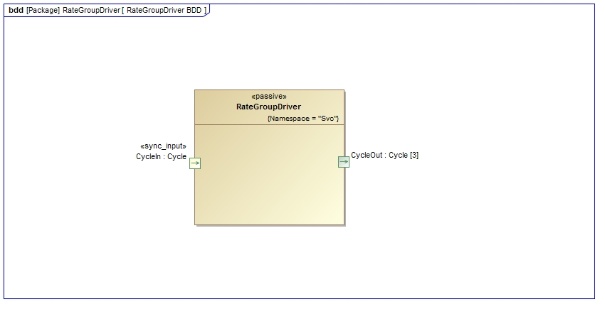
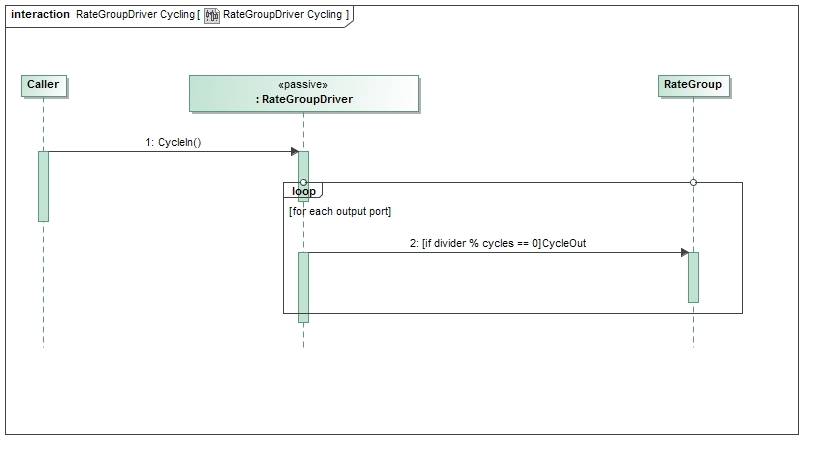

\page SvcRateGroupDriverComponent Svc::RateGroupDriver Component
# Svc::RateGroupDriver Component

## 1. Introduction

The RateGroupDriver Component is used to take a single system tick and distribute it to multiple rate groups in a system. 
It takes the input `Svc::Sched` port, then divides down the tick rate based on arguments to the constructor. 
Typically, the output ports would be connected to the asynchronous inputs of an `ActiveRateGroup`.

## 2. Requirements

The requirements for RateGroupDriver are as follows:

Requirement | Description | Verification Method
----------- | ----------- | -------------------
RGD-001 | The 'Svc::RateGroupDriver' component shall divide a primary system tick into the needed rate groups | Unit Test
RCD-002 | The 'Svc::RateGroupDriver' component shall be able to run in ISR context | Inspection

## 3. Design

### 3.1 Context

#### 3.1.1 Component Diagram

The Svc::RateGroupDriver component has the following component diagram:

#### 3.1.2 Ports

The Svc::RateGroupDriver component uses the following port types:

Port Data Type | Name | Direction | Kind | Usage
-------------- | ---- | --------- | ---- | -----
[`Svc::Cycle`](../Sched/docs/sdd.html) | CycleIn | Input | Synchronous | Receive the system tick
[`Svc::Cycle`](../Sched/docs/sdd.html) | CycleOut| Output | n/a | Used to drive rate groups

#### 3.2 Functional Description

The Svc::RateGroupDriver component has one input port that receives a system tick. 
The constructor has an array of integer arguments that specifies the divisors for each output port.

    RateGroupDriverImpl(const char* compName, NATIVE_INT_TYPE dividers[], NATIVE_INT_TYPE numDividers);

The input rate will for each output port will be divided down by the value in the `dividers[]` array corresponding to the output port number.

The implementation will be ISR compliant by avoiding the following:

* Floating point calculations
* Taking mutexes
* Calling libraries with unknown side effects
* Long implementation

For instance,

`SchedIn` Rate | `divider[0]` | `SchedOut[0]` | `divider[1]` | `SchedOut[1]` | `divider[2]` | `SchedOut[2]`
-------------- | ------------ | ------------- | ------------ | ------------- | ------------ | -------------
1Hz | 1 | 1Hz | 2 | 0.5Hz | 4 | 0.25Hz

### 3.3 Scenarios

#### 3.3.1 System Tick Port Call

As described in the Functional Description section, the RateGroupDriver component accepts calls to the SchedIn and divides them down to the SchedOut ports:

 

### 3.4 State

RateGroupDriver has no state machines.

### 3.5 Algorithms

RateGroupDriver has no significant algorithms.

## 4. Dictionary

No dictionary for this module

## 5. Module Checklists

Document | Link
-------- | ----
Design Checklist | [Link](Checklist_Design.xlsx)
Code Review Checklist | [Link](Checklist_Code.xlsx)
Unit Test Checklist | [Link](Checklist_Unit_Test.xlsx)

## 6. Unit Testing

[Unit Test Output](../test/ut/output/test.txt)

[Coverage Output - `RateGroupDriverImpl.cpp`](../test/ut/output/RateGroupDriverImpl.cpp.gcov)

## 7. Change Log

Date | Description
---- | -----------
6/19/2015 | Design review edits
7/22/2015 | Design review actions
9/2/2015| Unit test updates

