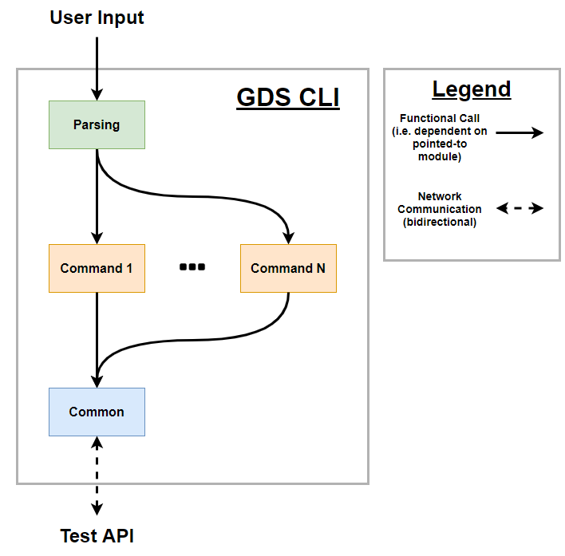
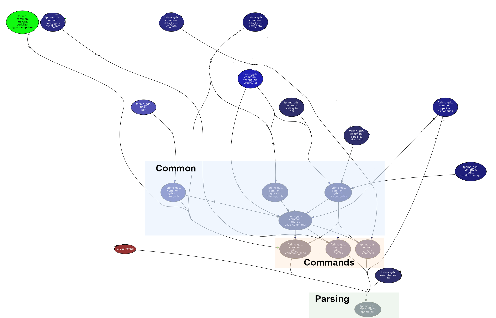

# GDS CLI - Developer's Guide

This guide is for programmers who intend to maintain and develop code for the Ground Data System's command-line interface suite. For regular users who just want to use these CLI tools, please see the [user guide](../../docs/UsersGuide/gds/GDS_CLI_USER_GUIDE.md).

- [CLI Requirements](#cli-requirements)
    - [Primary Requirements](#primary-requirements)
    - [Secondary Requirements](#secondary-requirements)
- [Architecture](#architecture)
    - [Intended](#intended)
    - [As Implemented](#as-implemented)
    - [Dataflow](#dataflow)
    - [Dependencies](#dependencies)
    - [Source Files](#source-files)
- [Tests](#tests)
- [Code Quirks](#code-quirks)
- [Future Work](#future-work)
    - [Fixing Issues](#fixing-issues)
    - [New Features](#new-features)

## CLI Requirements

### Primary Requirements

-   Overall goal is to provide a command-line interface for interacting with the F' Ground Data System (GDS), which can be used entirely in place of the GDS GUI
    -   At a minimum, the CLI tools should allow for receiving all events/telemetry data from the GDS and sending commands to the spacecraft
-   The CLI tools' output must be usable with existing UNIX utilities through piping/file output/BASH scripting/etc.
-   The CLI tools should be multi-platform, supporting (at a minimum) Linux, Mac, and Windows systems
-   If implemented in Python, must support Python 3.5+

### Secondary Requirements

-   Feature parity should be maintained between the GDS GUI and the GDS CLI tools as far as possible
-   Tools should be performant (finish executing in <100ms unless explicitly waiting for new data)
-   CLI tools should work "out of the box" with minimal or no setup/configuration
-   GDS CLI options/names/operations should be consistent with the GDS GUI first, then with other F' CLI tools, then with other UNIX conventions
-   Should be installable through a single pip command
-   Should support tab completion
-   Number of 3rd-party dependencies should be kept to a minimum
-   Should adhere to an MVC architecture, with parsing/printing separated from business logic

## Architecture

### Intended

The intended architecture for the CLI is:

-   A single `Parsing` module (if possible, a single file) which handles all argument parsing for the CLI tool; it determines what command was called and what arguments were provided to it
-   The actual command code is executed in a `Command` module; each CLI command has its own, independent module to handle execution
-   Any shared code between these modules is refactored into the `Common` module (notably, no direct calls should be made to the API from a `Command` module without going through a `Common` interface first)

The CLI will interact with the GDS through an appropriate API, which the CLI modules access through an interface in `Common`. While the REST API was initially targeted, we later decided to transition to the Integration Test API for now due to its filtering capabilities.

### As Implemented

Not including imports used only for type hints, or dependencies for modules not part of the GDS CLI source code (generated using [pydeps](https://pydeps.readthedocs.io/en/latest/):

*Note that the above graph has arrows pointing **to** the module that does the importing and away from the dependency, and does not include Python standard library imports*

-   All parsing is handled in `fprime_cli`, which imports the command modules and several external libraries to help with parsing.
-   Each command is implemented separately, but shares a large portion of its code with other modules via the `Common` module files, as well as importing the appropriate GDS data type for the type of data it's working with (and, in the case of `command_send`, an appropriate exception).
-   The `Common` module is actually made up of several distinct, independent submodules containing related groups of common code . These import a variety of other GDS modules to help provide all necessary functionality; in particular, the `testing_fw.api` Integration Test module is used to access the GDS.

### Dataflow

### Dependencies

External Dependencies (installed via `setup.py`):

-   [argcomplete](https://github.com/kislyuk/argcomplete) - Used to implement tab completion

Internal Dependencies (i.e. Other F' modules)

-   Integration Test API - Used to get data from and send commands to the GDS, and filter incoming data via the included predicates
-   `common/pipeline` and `common/utils` - Used to initialize the Test API; `pipeline.dictionaries` also used to get a list of available commands/events/channels
-   GDS Data Types in `common/data_types` - Used to handle incoming GDS data and for printing output
-   `fprime_gds/flask/json.py` - Used for the `--json` printing flag implementation
-   `executables/cli.py` - Used to automatically search for a dictionary file while parsing

Important Python `stdlib` Dependencies:

-   `argparse` - Used to handle parsing user input

### Source Files

Parsing files (in `executables`)

-   **fprime_cli.py** - Handles user input to the CLI tools via Python's `argparse` library; defines a base class for parsing and a subclass for each command. Uses `argcomplete` to handle tab completion if it's enabled, `cli.py` to search for a dictionary file, and then executes the appropriate command's function.

Command files (in `common/gds_cli`):

-   **channels.py** - Displays and filters received telemetry channel data. Handles printing and listing data; most functionality comes from `base_commands.py`.
-   **command_send.py** - Sends a given command to the GDS and prints an appropriate error message if this fails, and prints available commands. Filtering functionality comes from `base_commands.py`.
-   **events.py** - Displays and filters received telemetry channel data. Handles printing and listing data; most functionality comes from `base_commands.py`.

Common files (in `common/gds_cli`):

-   **base_commands.py** - Defines a base class for implementing commands with logging, and a child class for receiving and filtering GDS data
-   **test_api_utils.py** - Defines functions for initializing the Integration Test API and receiving data from the API
-   **filtering_utils.py** - Defines classes and functions used to filter GDS data using the Integration Test API's predicates
-   **misc_utils.py** - Any other functions used by multiple CLI commands that haven't been categorized (currently includes string formatting functions and shared datatypes for CLI arguments)

## Tests

The GDS CLI tests can be found at `Gds/test/fprime/common/gds_cli`, and currently includes 2 unit test files:

-   `filtering_utils_test.py` tests that filtering lists and GDS data works as expected
-   `utils_test.py` tests `misc_utils` and `test_api_utils` functions, verifying that commands listening for data exit when interrupted, and that getting lists of items works successfully

Test coverage is fairly low; there are currently no integration tests for the CLI.

## Code Quirks

-   `fprime_cli.py` and `misc_utils.py` use delayed/lazy importing to avoid slow performance from several particularly long imports
    -   In particular, `fprime_gds/flask/json.py` and `common/logger/test_logger.py` each take 100ms+ to import
    -   The script takes noticeably longer to run if the optional `openpyxl` is installed, since it's a slow import for the Test API
-   While technically true for all GDS python code, the [fast_entry_points](https://github.com/ninjaaron/fast-entry_points) script was used to improve startup speed
    -   Low startup times are especially important because tab completion re-runs the script each time tab is hit
-   Code uses type hints, introduced in Python 3.5
-   Commands don't bother initializing the Test API when passed the `--list` option for performance reasons
-   The parsing/command classes currently have all their functionality implemented on class methods, and are never instantiated
-   Printing uses `SysData` printing methods, which means console output will change if those `SysData` methods change
-   When used for filtering, the `filtering_util` predicates are called on entire `SysData` objects
-   New event/channel retrieval methods defined in `test_api_utils` instead of using the Test API's existing `await_telemetry`/etc. methods, since those only accept predicates filtering by time or one of the predefined `telemetry_predicate` or `event_predicate` fields; defining our own methods lets us use any predicate that will accept a `SysData` object
    -   This lets us also filter by component, printed strings, etc. at the cost of having slightly more complicated predicates
-   The `search` filter option doesn't take multiple arguments like the other filtering options (done to allow for multi-word string queries more easily, but might not be worth breaking the multiple-filter pattern of the other ones)
-   CLI filters are inclusive OR with themselves but exclusive to one another (e.g. passings multiple `ids` will show all data with any of those ID types, but passing `--ids` and `--search` will only show data with those IDs AND having that search term)
-   MVC isn't strictly followed, since the base command class has a logging method for convenience (and since we have to print on data receipt), but parsing is separated from execution code

## Future Work

### Fixing Issues

-   Getting tab completion to automatically install, rather than be user-activated (headache since user has to source a script from `argcomplete`)
-   Improve performance
    -   Fix problem of just having `openpyxl` installed slowing the script down because of import time
    -   Test API is slow to shut down for some reason, due to a slow thread join
-   Create basic integration tests for each CLI tool to make sure they work successfully end-to-end

### New Features

-   Adding CLI tools for file uplink/downlink
-   Extending tab completion to component names/opcodes/etc.
-   Immediate value querying (i.e. ask what the value of a channel/etc. is now, instead of just recording updates)
    -   Nice-to-have, may not be possible with Integration Test API
-   Having colored output to improve readability
-   Talk to testers using the GDS to figure out useful quality-of-life features
